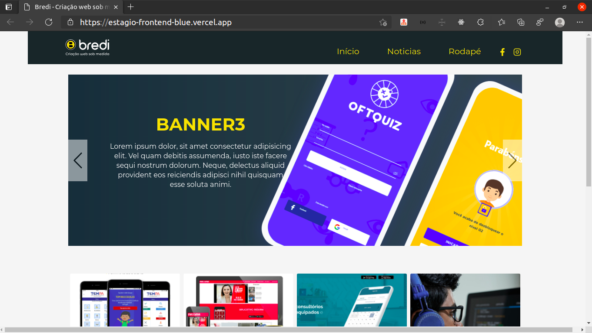

# TESTE DE ESTÁGIO FRONT-END HTML, CSS E JAVASCRIPT
> link do projeto Adobe XD: https://xd.adobe.com/view/a44042ef-99e2-46fa-545c-ce4f6686b811-d271/?fullscreen

<p align="center">
  
  <h3 align="center">Bredi - Página Inicial</h3>
</p>
<p align="center">
  <a href="#Teste-Front-End">Teste</a> | 
  <a href="#Author">Contato</a>
</p>

## Desenpenho e funcionalidades realizadas 
- [X] Criação a Navbar fixed no topo
- [X] Criação da section carousel
- [X] Criação da section de serviços
- [X] Criação do footer com inforções de contato
- [X] Criação do layout responsivo
- [X] Implementação de Custom funcionalidades e alimentação do carousel por uma lista no arquivo **data.js**
- [X] Deploy da Aplicação na vercel <a href="https://estagio-frontend-blue.vercel.app/">Link Teste Front-end</a>

## Author
**Raphael Gregg**
<p>
<a href="mailto:raphaelgregg@gmail.com">raphaelgregg@gmail.com</a>
</p>
<p>
<a href="https://www.linkedin.com/in/raphaelgregg/">Linkedin</a>
</p>
<br></br>

## Teste-Front-End
1. Importante
```sh 
Prazo de entrega: 12/03/2021
```

2. Regras
 - Codificar o layout em CSS, HTML e Javascript
 - Usar font montsserat (google fonts)
 - Usar as cores utilizadas no layout
 ```sh
   #F7D622 amarelo
   #1B2629 escuro
   #707070 descrição dos cards
 ```
 - As imagens estão nesse repositório.
 - É importante o layout ser responsivo.

3. CENÁRIO
 - Um cliente precisa criar seu site com as tecnologias boostrap 4 e javascript.

4. DEVERES
 - Header responsivo
 - Banner utilizando carrossel
 - Utilizar javascript com animações ao seu critério.

5. CONCLUSÃO
- Após finalizar solicite um pull request nesse repositório ou envie um e-mail para contato@bredi.com.br com os seus dados.
